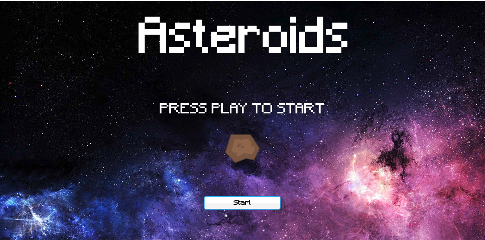
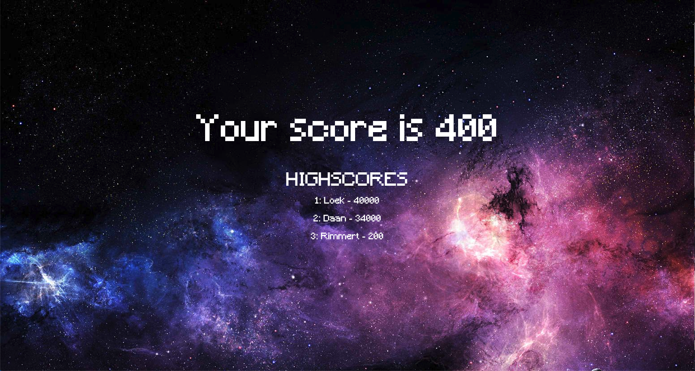

# Workshop Canvas

All code is based on the ts-skeleton-app template.

- starter code is found in the start folder.
- end code is found in the finished folder.

## Helpfull links

- [Canvas API](https://developer.mozilla.org/en-US/docs/Web/API/Canvas_API/Tutorial)
- [Canvas in book Eloquent JavaScript](https://eloquentjavascript.net/17_canvas.html)
- [Webfont loader](https://github.com/typekit/webfontloader)
- [Arrow functions](https://codeburst.io/javascript-arrow-functions-for-beginners-926947fc0cdc)
- [Images in Canvas](https://developer.mozilla.org/en-US/docs/Web/API/Canvas_API/Tutorial/Using_images)
- [Centering text in the Canvas](http://www.ckollars.org/canvas-text-centering.html)
- [Centering text in a button](https://stackoverflow.com/questions/24565458/centering-text-inside-a-canvas-rectangle-button)
- [HTML Element](https://developer.mozilla.org/en-US/docs/Web/API/HTMLElement)

## Assignment

Create the following screens in the Game class.

### Start screen

### Level screen

### Title screen

