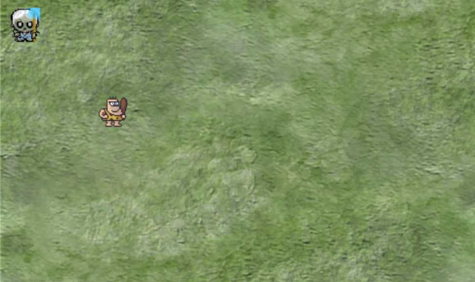
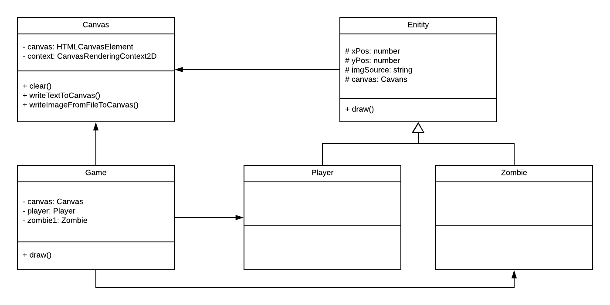

# Assignment Zombie vs Caveman

## Omschrijving

In deze game is de speler een caveman die zombies moet neerknuppelen. De zombie wordt op een willekeurige plek in het canvas getekend. Wanneer de speler de zombie 'aanraakt' verdwijnt de zombie en krijgt de speler een punt.

## Class diagram
Een eerste versie van het class diagram

## Steps

1. Create a canvas class.
2. Develop the game class.
3. Create the player class.
4. Draw the player on the canvas.
5. Create the zombie class.
6. Draw the zombie on the canvas (try to make it random)
7. Implement the controls (arrows) to control the player
8. Implement collision detection
